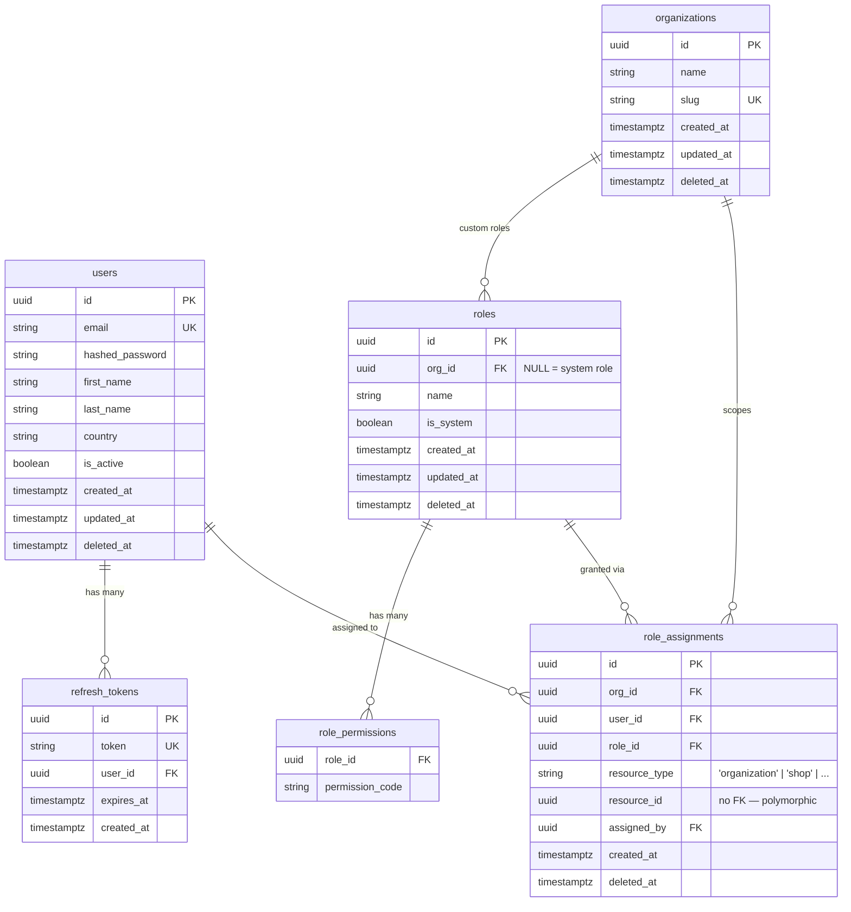

# Entity Relationship Diagram

Updated manually when models change. Source of truth is always the Alembic migrations.

## Notes

- `deleted_at` — soft delete; `NULL` means active. Hard delete after 30-day grace period.
- `refresh_tokens` — hard-deleted on logout or expiry; no soft delete, no `updated_at`/`deleted_at`
- `roles.org_id NULL` — system roles (owner, admin, member); shared across all orgs
- `roles.org_id SET` — custom roles scoped to that org; deleted when the org is deleted
- `role_assignments.resource_id` — no FK constraint; points to different tables depending on `resource_type`
- `role_assignments` replaces the old `organization_members` table — a user is "in an org" if they have at least one active assignment for that org
- Permissions for system roles are defined in `app/core/permissions.py` (`SYSTEM_ROLE_PERMISSIONS`); custom roles use the `role_permissions` table
- `assigned_by` — audit trail; SET NULL if the assigner's account is hard-deleted
