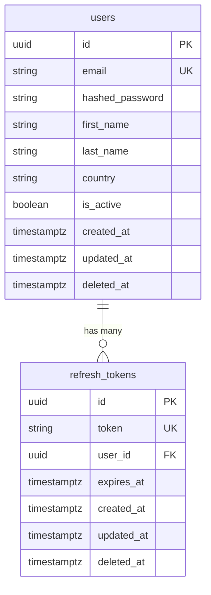

# Entity Relationship Diagram

Updated manually when models change. Source of truth is always the Alembic migrations.

## Notes

- `deleted_at` — soft delete; `NULL` means active. Hard delete after 30-day grace period.
- `refresh_tokens.user_id` — cascades on hard delete (`ON DELETE CASCADE`)
- One user can have multiple active refresh tokens (one per device/browser)
