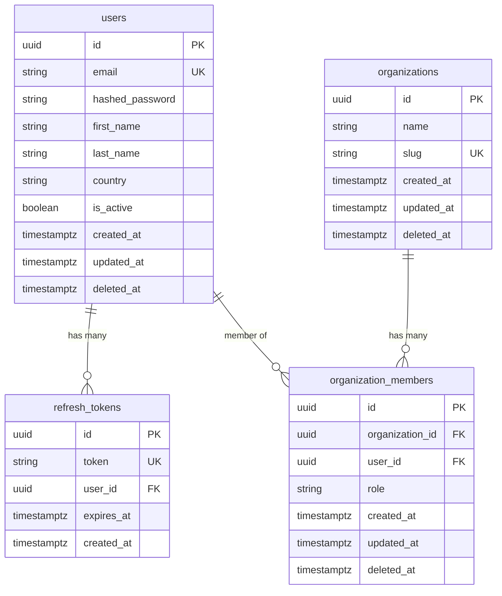

# Entity Relationship Diagram

Updated manually when models change. Source of truth is always the Alembic migrations.

## Notes

- `deleted_at` — soft delete; `NULL` means active. Hard delete after 30-day grace period.
- `refresh_tokens` — hard-deleted on logout or expiry; no soft delete, no `updated_at`/`deleted_at`
- `refresh_tokens.user_id`, `organization_members.organization_id`, `organization_members.user_id` — all cascade on hard delete (`ON DELETE CASCADE`)
- One user can have multiple active refresh tokens (one per device/browser)
- `organization_members` has a unique constraint on `(organization_id, user_id)` — one membership record per user per org
- `organizations.slug` — immutable after creation; used as subdomain (e.g. `acme.saas.com`)
